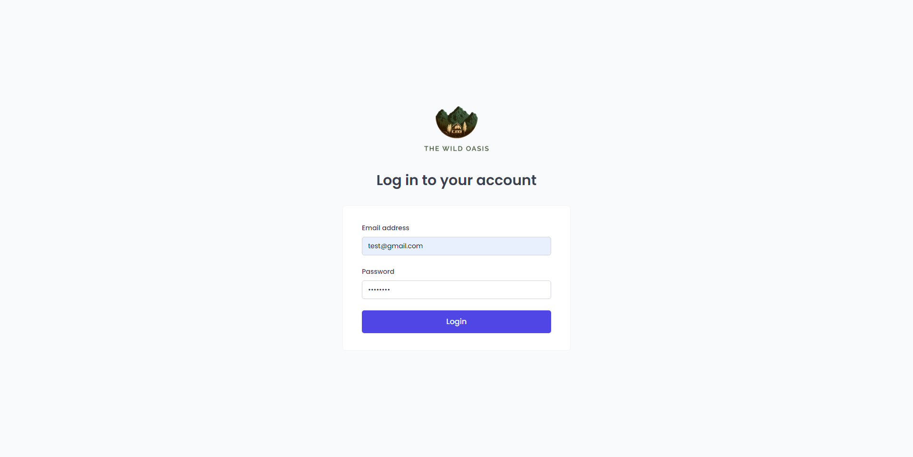
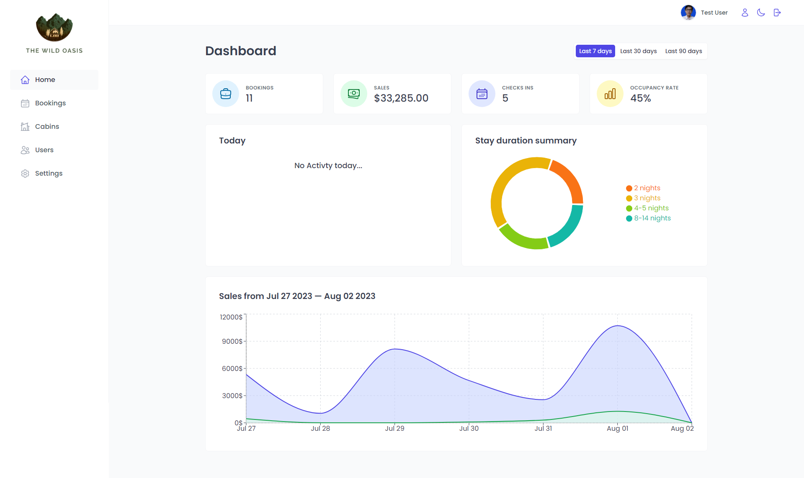
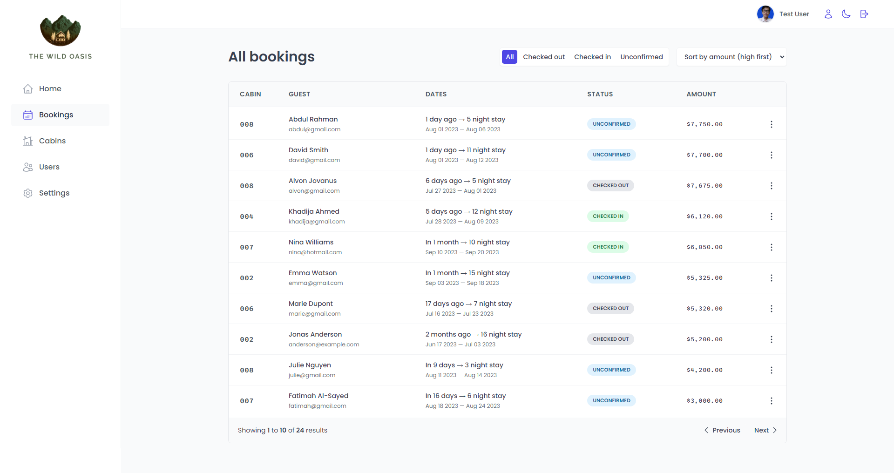
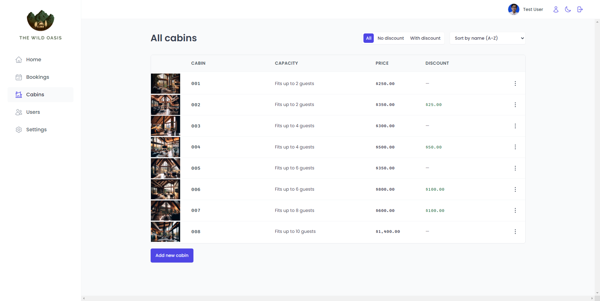
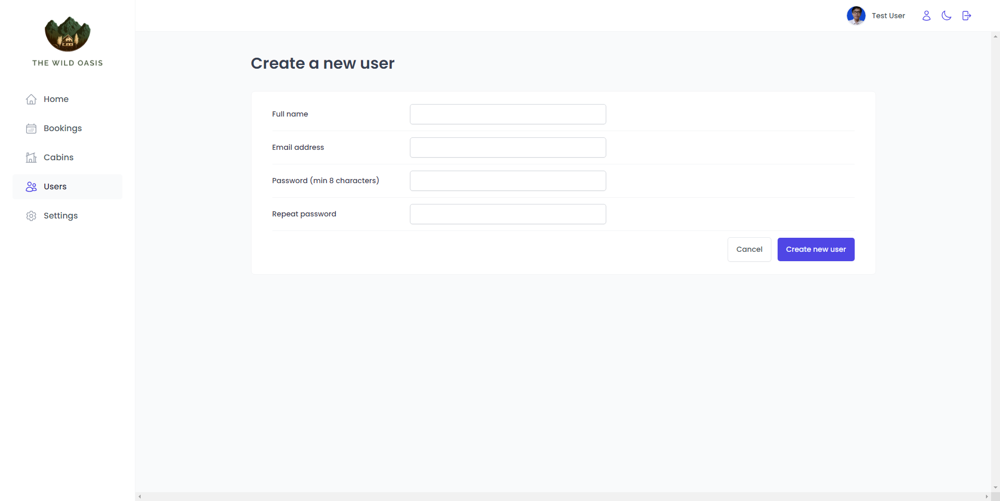
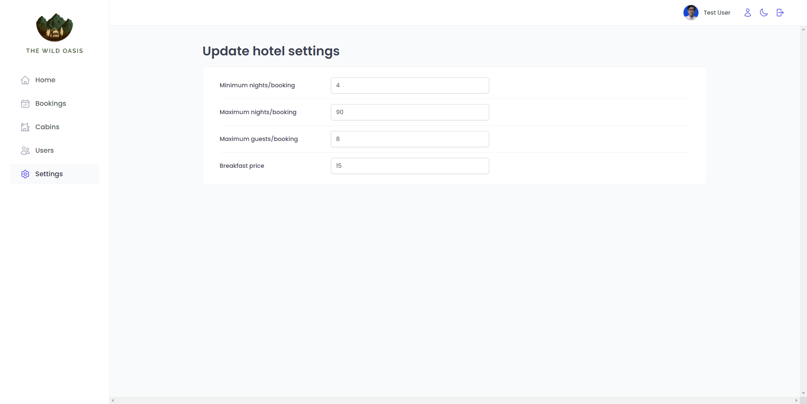
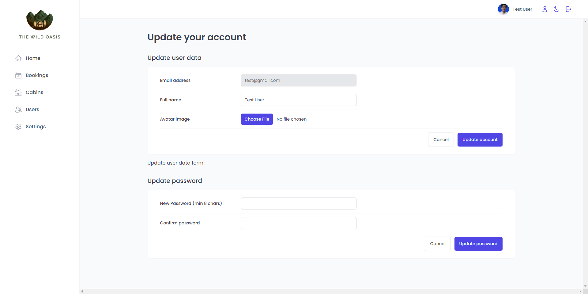

# The Wild Oasis

`Website only works on desktop/tablet mode`

React web appplication for booking cabin with authentication and authorization. Supabase is used for database service. Chart on the dashboard and also a darkmode feature.

## Techologies

- HTML
- CSS
- JavaScript
- React.js
- Supabase
- React Query
- React Icons
- React router
- Styled components
- Recharts
- Vite

## Link Website

https://the-wild-oasis-alvon.vercel.app/

| Email Address  | Password |
| -------------- | -------- |
| test@gmail.com | 12345678 |

## Screenshot

| Login Page                               |
| ---------------------------------------- |
|      |
| Dashboard Page                           |
| ------------------------------------     |
|  |
| Bookings Page                            |
| ------------------------------------     |
|   |
| Cabins Page                              |
| ------------------------------------     |
|     |
| Users Page                               |
| ------------------------------------     |
|      |
| Settings Page                            |
| ------------------------------------     |
|   |
| Edit user Page                           |
| ------------------------------------     |
|  |
